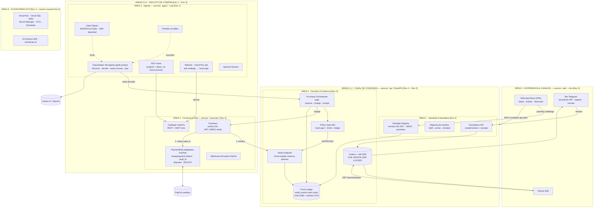
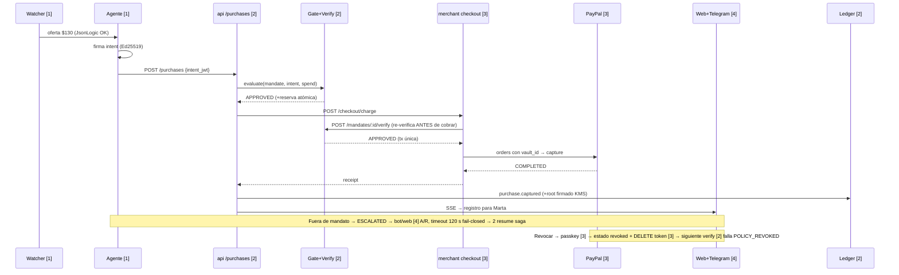

# PLAN-PARALELO v3 — Ejecución con 4 desarrolladores · Componentes, Contratos y Workstreams

> **🗺️ Nota de adaptación a este repo (Aval):** el monorepo descrito en §8 es exactamente la estructura de `aval/` (`kernel/` ≡ el servicio `api` del plan; `agent/` incluye el job watcher; `merchant/`; `web/`). Los contratos congelados están en [`../contracts/`](../contracts/) y el decision log calificado vive en [`../DECISIONS.md`](../DECISIONS.md). Idioma de los planes: español; idioma del repo: inglés.

> **Complemento de [PLAN.md](PLAN.md) (v2.3, plan maestro).** Descompone el sistema en **componentes clasificados por área general**, define los **contratos** que permiten construirlos de forma independiente, y asigna **4 workstreams paralelizables** con milestones de integración.
>
> **v3 — RECORTE POR CAPABILIDAD (decisión del equipo):** **Dev 1 = agéntica** (agente + watcher) · **Dev 2 = fraude, contratos e idempotencia** (gate, verify, saga, ledger) · **Dev 3 = API backend** (mandatos + passkeys, escalations, catálogo, checkout, rail PayPal) · **Dev 4 = front & plataforma** (consolas, bot, GCP, CI/CD). La subdivisión C1/C2/C3 de v2.1 queda **disuelta**: el cerebro va a Dev 1; el dinero y la tienda, a Dev 3 (ver §3.1).
>
> **v2 — TOPOLOGÍA MICROSERVICIOS + FRONTEND SEPARADO (ADR-022):** el frontend (`web`) es un **servicio y workstream propio (Dev 4)** que consume únicamente contratos públicos. Las vistas ya NO se reparten entre devs de backend.
>
> **v2.1 — ADR-006 v2.3 aplicado:** el agente NO usa LangGraph — el orquestador es un **grafo propio** (ideas críticas retenidas: grafo explícito, checkpointing en `agent_runs`, nodo `await_human`).
>
> **Regla de oro del paralelismo:** cada dev construye contra **contratos y mocks congelados**, no contra el código de los demás. Ningún módulo espera a otro: se integra por milestone.
>
> **Fecha:** 2026-08-29 · **Estado:** Borrador v3 (congelar en G0)

---

## 1. Diagrama de componentes por áreas generales



**Leyenda de áreas, servicios y dueños (recorte por capacidad — decisión #19 del repo):**

| Área general | Componentes | Servicio (deployable Cloud Run) | Dueño |
|---|---|---|---|
| **1. Identidad & Mandatos** | Mandate Registry (SD-JWT/JWKS/passkeys), máquina de estados, Escalations API | `api` (routers) | **Dev 3** |
| **2. Decisión & Evidencia** | Policy Gate, Verify Endpoint, Purchase Orchestrator, Proof Ledger, Outbox+relé | `api` (routers) | **Dev 2** |
| **3. Agente Autónomo** | Orquestador grafo propio (ADR-006), Intent Signer, MCP client, Watcher job, Presidio, injection fixtures | `agent` + Cloud Run job | **Dev 1** |
| **4. Comercio & Rail** | Catálogo VuelaYa, Checkout, PaymentRail (PayPal), webhooks firmados | `merchant` | **Dev 3** |
| **5. Experiencia & Canales** | Web App completa (3 vistas), bot Telegram, cliente SSE | `web` | **Dev 4** |
| **6. Plataforma GCP** | bootstrap.sh, CI/CD, Scheduler, secretos, dominio | `infra/` | **Dev 4** (mantenimiento) + sesión conjunta Día 0 |

> Cinco deployables independientes (`web`, `api`, `agent`, `merchant`, `watcher` job) — cada uno con su CI por rutas del repo y su ciclo de deploy. `api` sigue siendo UN deployable con routers de Dev 2 y Dev 3: paralelismo a nivel módulo (carpetas separadas, CODEOWNERS, cero imports cruzados 2↔3 fuera de `trustlib`). El frontend **no comparte nada** con el backend: sus tipos TS se generan de `contracts/api.yaml`.

---

## 2. Inventario de componentes (responsabilidad · entradas · salidas)

| # | Componente | Dueño | Servicio | Responsabilidad | Consume (contrato) | Produce (contrato) |
|---|---|---|---|---|---|---|
| C1 | Mandate Registry | 3 | api | Emitir mandatos SD-JWT firmados; JWKS; ceremonia passkey | `MandateClaims` (trustlib) | `POST /mandates`, `GET /.well-known/jwks.json` |
| C2 | Máquina de estados | 3 | api | Transiciones con guard; revocación dispara `PaymentRail.delete_token` | DDL `mandates`; `PaymentRail` (interfaz) | eventos `mandate.*` |
| C3 | Escalations API | 3 | api | Crear/resolver escalamientos; approval receipts firmados | `Escalation` (trustlib) | `POST /escalations/{id}/resolve`, eventos `escalation.*` |
| C4 | Policy Gate (lib) | 2 | api | Evaluación determinista: JsonLogic + limits + spend → Decision | `SignedMandate`, `PurchaseIntent`, `SpendView` | `PolicyGate.evaluate()` |
| C5 | Verify Endpoint | 2 | api | SD-JWT + intent firmado + estado + **reserva atómica** en 1 tx | C1 (JWKS), C4, DDL | `POST /mandates/{id}/verify` |
| C6 | Purchase Orchestrator | 2 | api | Saga: intent → gate → checkout merchant → receipt/compensación | merchant `/checkout/charge` (3) | `POST /purchases`, eventos `purchase.*` |
| C7 | Proof Ledger | 2 | api | `audit_events` hash-chain; roots KMS; witness GCS | KMS `EC_SIGN_ED25519` | `GET /audit/events`, `GET /audit/verify` |
| C8 | Outbox + relé | 2 | api | Eventos en la tx del negocio; relé SKIP LOCKED → SSE/bot/webhook | `EventEnvelope` | `GET /events/stream` |
| C9 | Orquestador del agente (grafo propio) | 1 | agent | Grafo discover→decide→`await_human`→pay; checkpointing en `agent_runs`; replanificación | MCP tools (de 3), `POST /purchases` (2), escalations (3) | — |
| C10 | Intent Signer | 1 | agent | Par Ed25519 del agente; JWS detached sobre intent canónico (JCS) | `PurchaseIntent` | `intent_jwt` |
| C11 | Watcher job | 1 | job | Poll catálogo → evaluar JsonLogic → disparar compra | Catálogo (de 3), Scheduler OIDC | evento `offer.seen` |
| C12 | Presidio middleware | 1 | agent | Scrub PII de todo lo que entra/sale del LLM/logs del agente | — | — |
| C13 | Injection fixtures | 1 | agent | ≥10 descripciones maliciosas + suite de test | Catálogo (de 3) | T11 |
| C14 | Catálogo VuelaYa | 3 | merchant | Ofertas REST + MCP tools; precios que mutan para el demo | `Offer` | `GET /catalog/offers`, MCP tools |
| C15 | Checkout merchant | 3 | merchant | Verificar mandato (SD-JWT contra JWKS + verify) → cobrar → receipt | C1 (JWKS), C5 (verify), `PaymentRail` | `POST /checkout/charge` |
| C16 | PaymentRail (PayPal) | 3 | merchant | setup/payment tokens, orders con vault_id, disputes, DELETE, webhook verify | PayPal REST | interfaz `PaymentRail` (trustlib) |
| C17 | Webhooks entrantes | 3 | merchant | `PAYMENT.CAPTURE.COMPLETED`, `CUSTOMER.DISPUTE.*` verificados | PayPal | eventos `payment.*`/`dispute.*` |
| C18 | Web App React | 4 | web | 3 vistas (Marta/Auditor/Merchant); passkeys; disputar; timeline | **solo api.yaml + SSE** (tipos generados) | — |
| C19 | Bot Telegram | 4 | web*/api | Escalación inline keyboard + timeout 120 s fail-closed; registro; `/revoke` | eventos outbox, C3 | callbacks → C3 |
| C20 | Plataforma GCP + CI/CD | 4 | infra | bootstrap.sh idempotente, GH Actions WIF, min-instances, Scheduler, CORS, dominio | `infra/` | ambiente `app.<dominio>` |

> *El bot de Telegram es un proceso liviano con webhook en `api.<dominio>/bot/telegram` (router propiedad de 4, montado en el deployable `api` para no crear un servicio solo para él — mismo patrón routers por dueño).

---

## 3. Los 4 workstreams (planes independientes · recorte por capacidad)

### Perfil y misión

| Dev | Workstream | Misión en una frase | "Definition of done" |
|---|---|---|---|
| **1** | **La agéntica (agente + watcher)** | Que el agente descubra y proponga de verdad — útil, resistente a inyección, y estructuralmente incapaz de pagar fuera del gate | Grafo propio con `await_human` idempotente (checkpointing `agent_runs`); intents firmados (JCS + EdDSA); watcher + trigger manual; trazas scrubbeadas; suite de inyección 100% bloqueada por el gate |
| **2** | **Fraude, contratos e idempotencia (kernel decisión)** | Que NINGUNA compra fuera de mandato pase jamás, que los contratos firmados se verifiquen de verdad, y que toda operación sea exactamente-una-vez con evidencia criptográficamente verificable | Invariant T1 en verde; reserva atómica sin races; idempotency keys; hash chain detecta mutación; `/audit/verify` en vivo; saga con compensación |
| **3** | **API backend (kernel identidad + merchant)** | Que existan todas las superficies API — mandatos con passkeys, escalations, catálogo, checkout y el rail PayPal — y que VuelaYa verifique el mandato ANTES de cobrar | Mandato SD-JWT verificable contra JWKS; revocación con passkey mata mandato Y payment token; enrollment→vault_id→capture→disputa→DELETE en sandbox; checkout que rechaza 402 sin verify APPROVED |
| **4** | **Experiencia & Plataforma (frontend + canales + GCP)** | Que humanos, jueces y auditores operen todo desde interfaces impecables, y que el sistema viva desplegado y reproducible en GCP | 3 vistas completas contra contratos; bot con timeout fail-closed; deploy 1-click; smoke T15/T16 en verde; demo sin cold starts |

### Plan día a día por workstream

**Día 0 (tarde conjunta, ~4 h — todos):** proyecto GCP + dominio + bootstrap + PayPal smoke test + **congelar contratos v1.0** (`contracts/`) + scaffold del monorepo + `trustlib` v0.1 + **codegen de tipos TS** (`npm run gen` desde api.yaml) + mocks en docker-compose. *Nadie empieza su build hasta que M0 esté en verde.*

| Día | Dev 1 — Agéntica | Dev 2 — Fraude & contratos | Dev 3 — API backend | Dev 4 — Front & plataforma |
|---|---|---|---|---|
| **1 AM** | *(espera deliberada: consume mocks)* + strings de inyección para los fixtures compartidos (`contracts/fixtures/`) | Policy Gate con TDD: T1 (property-based), T10 (JsonLogic) | SD-JWT issuance + JWKS + firma (PEM en Secret Manager) | Scaffold `web` (Vite+React) + codegen tipos + shell/rutas/estado + CORS en mocks |
| **1 PM** | Grafo propio esqueleto + `await_human` contra mock /purchases | Verify endpoint con reserva atómica: T4, T5, T6 (con SD-JWT de fixture de trustlib) | Passkey ceremony (challenge = hash del mandato) + máquina de estados (T8) | Bot Telegram esqueleto + hook SSE (`/events/stream` contra mock) |
| **1 FIN** | Intent Signer: JCS + JWS detached (T3) | **M1: handshake 2↔3** (2 verifica SD-JWT real de 3) + orchestrator contra mock-merchant | **M1** + `PaymentRail` contra sandbox real arrancado (T17) | `web` desplegada en Cloud Run + contract-tests contra mocks |
| **2 AM** | MCP client real + delimitación de outputs | Ledger hash-chain + KMS roots + witness GCS (T9) | Catálogo REST + MCP tools + fixtures de precios + T17 en verde | UI Marta: crear mandato con passkey + dashboard de gasto |
| **2 PM** | Watcher job + trigger manual OIDC + **M3 (con 2/3): revocación e2e** | Outbox + relé SKIP LOCKED → SSE (T7 junto a 1) | Escalations API + approval receipts + checkout: verifica SD-JWT + verify + cobra vía PaymentRail → **M2: saga real 2↔3** | UI Marta: revocar + disputar compra; bot escalación A/R + timeout fail-closed |
| **2 FIN** | Presidio middleware (T12) | **M3** (T5/T6/T7 en verde) + endpoint `/audit/verify` | **M3: revocación e2e** (passkey → estado → DELETE token → compra falla ≤2 s) + webhooks firmados (T14) | UI Auditor: trail + verify en vivo |
| **3 AM** | Suite de inyección completa (T11) + timing del watcher | Evidence bundle de disputa + veredicto (T18, junto a 3) | Disputa sandbox (T18 junto a 2) + mini-mandatos sticky + hardening | UI Merchant + smoke T15/T16 + min-instances + video backup |
| **3 PM** | **M5** + ataque en vivo ejecutado por "jueces" | M5 + métricas (revocación ≤2 s) | **M5** ensayo general | M5 + README + repo público pulido |
| **3 FIN** | Guion de demo/ataque | Decision log final (ADRs) | Diagrama final + README técnico | Video + README final |

**Backlog de contingencia por workstream (cortar primero):** 1: Presidio → solo delimitación de outputs · 2: witness GCS → solo roots firmados en BD · 3: mini-mandatos sticky → flag transitorio; webhooks → polling simple · 4: UI Merchant → fusionar con vista Auditor; bot → solo dashboard web.

**Regla de re-balanceo:** Dev 3 lleva la carga más completa (identidad + tienda + riel). Si se atasca el Día 1: **el catálogo pasa a Dev 1** (fixtures triviales, ~2 h) y **el checkout pasa a Dev 2 tras M1**. La cripto de mandatos (SD-JWT/passkeys) no se mueve — es el corazón de G1. Dev 1 es el más liviano hasta el Día 2: puede absorber catálogo e inyección temprano si hace falta.

### 3.1 Historia: la subdivisión C1/C2/C3 (v2.1) quedó disuelta en v3

El recorte por capacidad la disuelve: **C3 (el cerebro) → Dev 1**; **C1 (el dinero) y C2 (la tienda) → Dev 3**. Las fronteras que la hacían posible siguen vigentes: la interfaz `PaymentRail` separa checkout de riel dentro de Dev 3, y el contrato MCP (schemas.md §10) separa tienda de agente (3↔1). El invariante anti-manipulación (`intent.amount == offer.price`, verificado contra el catálogo) no cambia de dueño conceptual: lo produce el agente (1), lo monta la tienda (3), lo hace valer el verify (2).

---

## 4. Mapa de dependencias y contratos (quién contrata con quién)

```mermaid
flowchart LR
    subgraph CONTRATOS["CONTRATOS CONGELADOS EN M0 (carpeta contracts/)"]
        K1["K1 · api.yaml<br/>(OpenAPI: endpoints + DTOs)"]
        K2["K2 · schemas.md<br/>(SD-JWT, intent JCS,<br/>eventos, error codes, DDL)"]
        K3["K3 · trustlib (Python)<br/>+ tipos TS generados"]
    end
    D1[Dev 1<br/>Agéntica] --> K2
    D2[Dev 2<br/>Fraude & contratos] --> K2
    D3[Dev 3<br/>API backend] --> K2
    D4[Dev 4<br/>Front & plataforma] --> K1
    D1 & D2 & D3 --> K3
    D4 -->|codegen| K1
    D2 -.|"saga: /checkout/charge"| D3
    D1 -.|"compra → /purchases · escalation resume"| D2
    D3 -.|"JWKS · escalations API"| D2
    D4 -.|"consume TODO por REST/SSE<br/>(cero código backend)"| D1 & D2 & D3
```

*(La revocación — passkey → estado → `DELETE` del token — es ahora íntegra de Dev 3: estado y rail viven en el mismo workstream.)*

**Acréditos de dependencia (qué necesita cada dev para EMPEZAR — todo disponible desde M0):**

| Dev | Necesita para construir | Fuente | Estado desde |
|---|---|---|---|
| 1 | Catálogo **mock** (MCP tools), `/purchases` **mock**, JWKS mock (clave de prueba en fixtures), semántica de escalation-resume (schemas.md §5) | K1, K2 | M0 |
| 2 | `MandateClaims` + verifier SD-JWT de fixture, `PurchaseIntent` + verifier, DDL completo, mock-merchant | K2, K3 | M0 |
| 3 | Esquema `MandateClaims`, DDL `mandates`/`escalations`, interfaz `PaymentRail`, generador de intents firmados (para probar verify), PayPal sandbox, mock-jwks | K2, K3 | M0 |
| 4 | **Solo `api.yaml` completo + `EventEnvelope` + mock-api/mock-merchant corriendo** (sus tipos TS se generan; nunca lee Python) | K1, K3-codegen | M0 |

**Los mocks viven en `contracts/mocks/` y son propiedad COMUNIDAD:** cada mock implementa literalmente el contrato y nadie lo cambia sin bump. Un mock que "aprueba todo" está prohibido: el mock de verify decide según el mismo fixture del mandato — así 1 y 4 prueban caminos feos antes de la integración real.

---

## 5. Milestones de integración (los únicos puntos de sincronización)

| Milestone | Cuándo | Qué se integra | Criterio de salida (binario) | Dueños |
|---|---|---|---|---|
| **M0 · Contratos congelados** | Día 0 tarde | `contracts/` v1.0 + trustlib v0.1 + tipos TS generados + mocks + monorepo (con devlogs abiertos + docs-guard en CI) + GCP hello-world + PayPal smoke | Un test en Python Y otro en TS consumen los mocks y aprueban/rechazan los fixtures canónicos | Todos |
| **M1 · Cripto handshake** | Día 1 fin | SD-JWT real de 3 verificado por el verify de 2 | 2 verifica: válido ✓, mutado 1 byte ✗, expirado ✗, sin KB ✗ | 3↔2 |
| **M2 · Happy path con rails reales** | Día 2 | Orchestrator 2 ↔ checkout 3 ↔ PayPal sandbox + agente 1 sobre catálogo real | T13 (demo-as-code) en verde contra servicios reales desplegados; la UI de 4 ya lo muestra por SSE | 2↔3 (+1) |
| **M3 · Trial by fire interno** | Día 2 fin | Revocación end-to-end (passkey 3 → estado 3 → DELETE token 3 → verify 2 falla ≤2 s) + escalación bot 4 con timeout + race doble compra | T6 + T17 + T5 + T7 en verde, grabados como evidencia | 1+2+3+4 |
| **M4 · Adversario + disputa** | Día 2 fin/Día 3 am | Mini-AgentDojo (1) + disputa sandbox PayPal resuelta por evidence bundle (2, rail 3) + vista de disputa (4) | T11 100% bloqueado por gate; T18 veredicto coherente | 1, 2+3, 4 |
| **M5 · Ensayo general en GCP** | Día 3 | Sistema completo en `app.<dominio>` con min-instances; 2 corridas del guion por personas ajenas al código | G6 del plan maestro; cronómetro de cada escena | Todos |

**Ceremonia diaria:** 15 min al inicio (¿qué contrato me está faltando?) y sync en M-milestones. Fuera de eso, cero dependencia interpersonal.

---

## 6. Reglas de paralelismo (el "contrato social")

1. **Contratos antes que código.** Nadie escribe un endpoint/modelo/pantalla que no esté en `contracts/`. Si falta → se propone el cambio (regla 2), no se improvisa.
2. **Cambios de contrato:** PR sobre `contracts/` con revisión de los dueños afectados + bump (`v1.x` aditivo, `v2` rompible — solo antes de M2) + **actualizar mock, trustlib Y regenerar tipos TS en el mismo commit** + registro en `docs/decisions/` (el guard de CI lo exige). Anuncio en el canal.
3. **Ownership estricto:** CODEOWNERS por carpeta (ver §8). Tocar el módulo de otro = PR con su approval. Hotfix crítico Día 3 con aviso.
4. **BD:** una migración por dev, solo sus tablas (1: `agent_runs` · 2: `purchase_intents`, `purchases`, `audit_events`, `outbox`, `idempotency_keys` · 3: `mandates`, `escalations`, `payment_instruments`, `offers` · 4: ninguna — solo infra). Cambiar tabla ajena = cambio de contrato.
5. **Ramas:** `ws-1/*`, `ws-2/*`, `ws-3/*`, `ws-4/*` → PR a `main`; CI dispara **por rutas** (`services/api/**` → api, `web/**` → web, etc. — cada servicio se despliega solo si cambió). `main` siempre desplegable.
6. **Los tests de contrato son la policía:** los mismos tests corren contra mock y contra real (parametrizados); si el real no pasa lo que el mock pasó, el CI lo dice antes que el equipo.
7. **Integración temprana y barata:** post M1/M2, cada dev integra a staging al menos 1×/día. Nada de "gran integración final".
8. **Prohibido:** aprobar todo en un mock, saltarse el gate "solo para avanzar", compartir claves por chat (Secret Manager o nada), y **que el frontend importe código backend** (si necesitas lógica del backend, es un endpoint que falta — propón el cambio de contrato).
9. **Documenta o no existe:** todo PR con código lleva una entrada en el devlog del workstream (`docs/devlogs/dev<N>.md` en el repo — dev1 a dev4); todo cambio de contrato o decisión técnica lleva un registro en `docs/decisions/`. **El guard de CI lo exige** (`scripts/docs-guard.sh` en el repo): código sin devlog, o contrato sin decisión, no mergea. Es lo que permite que 4 devs — o agentes IA — trabajen asincrónicos sin duplicar trabajo ni perder contexto: antes de empezar una tarea se leen las últimas 3 entradas del propio devlog y los índices de los demás.

---

## 7. Ownership de tests, gates y entregables

| Test (plan maestro §10) | Dueño | Milestone |
|---|---|---|
| T1 invariant property-based, T5 race, T6 TOCTOU, T9 hash chain, T10 JsonLogic, T4 verify codes, T13 demo-as-code | **2** | M0→M3 |
| T2 SD-JWT, T8 state machine, T14 webhooks, T17 rail PayPal, T18 disputa (con 2) | **3** | M1–M4 |
| T3 KB-JWT/impersonación, T7 idempotencia reanudación, T11 injection, T12 Presidio | **1** | M1–M4 |
| T15/T16 smoke contra GCP + bootstrap idempotente | **4** | M2–M5 |

| Gate (plan maestro §9) | Dueño principal |
|---|---|
| G0 contratos + ambiente | Todos (4 lidera bootstrap) |
| G1 cripto núcleo | 3 (2 verifica como consumidor) |
| G2 circuito feliz en Cloud Run | 2 (orquestador) + 3 (rails) |
| G3 casos feos | 2 + 3 (revocación) |
| G4 adversario | 1 |
| G5 disputa + auditor | 2 (evidencia) + 3 (rail) + 4 (vistas) |
| G6 ensayo general | Todos |
| G7 entregables | 1: guion demo/ataque · 2: decision log · 3: diagrama final + README técnico · 4: slides + repo + video |

---

## 8. Estructura del monorepo

```
aval/
├── contracts/                  # M0 — PROPIEDAD COMÚN, congelada
│   ├── api.yaml                # OpenAPI 3.1 (api + merchant)
│   ├── schemas.md              # SD-JWT · intent JCS · eventos · errors · DDL · interfaces
│   ├── mocks/                  # mock-api · mock-merchant · mock-jwks
│   └── fixtures/               # mandatos/intents/ofertas/injections canónicos
├── packages/
│   └── trustlib/               # [backend] Pydantic + ReasonCode + JCS + helpers + fake.*
├── services/
│   ├── api/                    # FastAPI
│   │   ├── routers/
│   │   │   ├── mandates.py     # [3]
│   │   │   ├── escalations.py  # [3]
│   │   │   ├── bot.py          # [4] webhook telegram (router de 4 en deployable api)
│   │   │   ├── verify.py       # [2]
│   │   │   ├── purchases.py    # [2]
│   │   │   ├── audit.py        # [2]
│   │   │   └── events.py       # [2] SSE + relé
│   │   ├── core/               # gate [2] · state machine [3] (carpetas separadas)
│   │   └── db/                 # migrations por schema
│   ├── agent/                  # [1] grafo propio (ADR-006) + watcher job + presidio + injection
│   └── merchant/               # [3] catálogo + checkout + paymentrail + webhooks
├── web/                        # [4 — SERVICIO PROPIO, ADR-022]
│   ├── src/
│   │   ├── views/marta/        # [4]
│   │   ├── views/auditor/      # [4]
│   │   ├── views/merchant/     # [4]
│   │   ├── api/                # tipos GENERADOS de contracts/api.yaml (npm run gen)
│   │   └── bot/                # lógica del bot de Telegram [4]
│   └── package.json            # script "gen": openapi-typescript ../contracts/api.yaml
├── infra/                      # [4] bootstrap.sh · workflows/ · scheduler · CORS
└── docs/                       # [todos] decisions/ (registros de decisión) + devlogs/ (dev1-dev4 — regla §6.9)
```

---

## 9. Secuencia end-to-end (fuente única de verdad del flujo)



---

## 10. Riesgos específicos del paralelismo y mitigación

| Riesgo | Mitigación |
|---|---|
| Dev 3 concentra identidad + tienda + riel (el lane más pesado del recorte v3) | Catálogo se desprende a Dev 1 (fixtures triviales ~2 h); checkout pasa a Dev 2 tras M1; la cripto de mandatos no se mueve (corazón de G1) |
| Un contrato resulta incompleto a mitad del Día 1 | Regla §6.2: PR aditivo `v1.x` + mock + trustlib + **regeneración TS** en el mismo commit; rompibles solo antes de M2 |
| Drift entre tipos TS (web) y Pydantic (backend) | Codegen único desde `api.yaml`; CI verifica que `web/src/api` esté regenerado (falla si el yaml cambió sin regenerar) |
| CORS/sesión entre `app.` y `api.` rompe la UI el Día 2 | 4 configura CORS por contrato en M0 (incluido en mocks); sesión cookie SameSite probada en el scaffold Día 1 |
| El mock de verify "aprueba todo" y 1/4 descubren caminos feos tarde | Regla §6.8: mock decide según fixture; contract-tests compartidos |
| 2 y 3 chocan dentro del deployable `api` | Routers y carpetas separados + CODEOWNERS; cero imports cruzados fuera de trustlib |
| Integración grafo propio `await_human` ↔ escalation resume (3↔2↔1) frágil | Contrato explícito (schemas.md §5) + T7 owner 1 + pairing 30 min en M3; el resume es código nuestro — depurable con un SELECT a `agent_runs` |
| Migraciones cruzadas rompen staging | Una migración por dev sobre sus tablas; heads lineales; CI aplica sobre BD efímera |
| 4 bloqueado esperando un endpoint que no existe | Regla §6.8-bis: si el frontend necesita lógica backend, es un endpoint que falta → cambio de contrato, nunca un workaround local |

---

## 11. Qué se congela en M0 (checklist del Día 0)

- [ ] `contracts/api.yaml` v1.0 revisado por los 4 (30 min de lectura cruzada: "¿puedo construir mi módulo con esto y nada más?")
- [ ] `contracts/schemas.md` v1.0 (SD-JWT claims, intent canónico JCS, eventos, error codes, DDL, interfaces Python)
- [ ] `trustlib` v0.1: modelos Pydantic + ReasonCode + canonical JSON + helpers SD-JWT + `fake.*`
- [ ] **Tipos TS generados** (`web`: `npm run gen` desde api.yaml) y compilando
- [ ] Mocks corriendo en docker-compose: mock-api (verify+purchases+jwks), mock-merchant (catálogo+charge), **con CORS habilitado para `app.localhost`**
- [ ] Monorepo scaffold + CI por rutas + CODEOWNERS + **docs-guard en CI** (devlogs dev1–dev4 y `docs/decisions/` creados — regla §6.9)
- [ ] Ambiente GCP hello-world (5 servicios desplegados con `--source`) + dominio comprado
- [ ] PayPal smoke test en verde (OAuth → setup token → payment token → capture con vault_id → disputa → DELETE)
- [ ] Decisiones D1–D7 del plan maestro §14 cerradas (LLM, branding, dominio)

> **Si M0 se congela bien, los Días 1–3 son cuatro builds independientes que solo se tocan en M1–M5. Si M0 se congela mal, no hay paralelismo que salvar el cronograma.**
