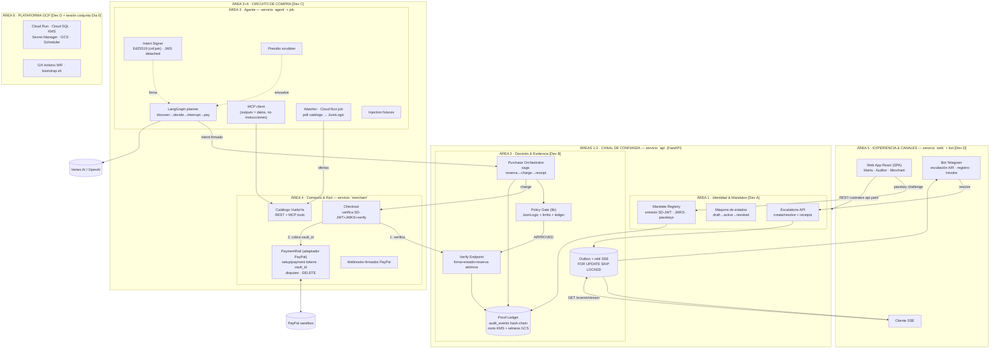
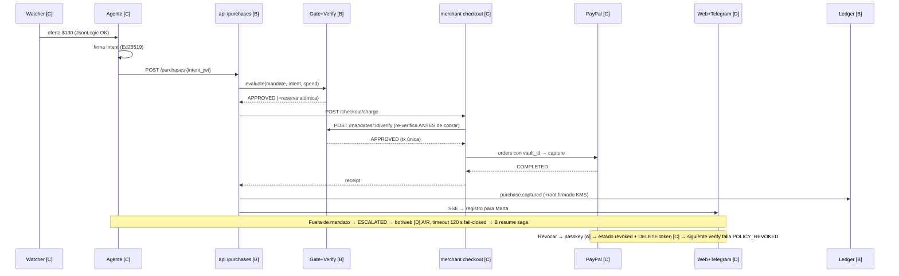

# PLAN-PARALELO v2 — Ejecución con 4 desarrolladores · Componentes, Contratos y Workstreams

> **🗺️ Nota de adaptación a este repo (Aval):** el monorepo descrito en §8 es exactamente la estructura de `aval/` (`kernel/` ≡ el servicio `api` del plan; `agent/` incluye el job watcher; `merchant/`; `web/`). Los contratos congelados están en [`../contracts/`](../contracts/) y el decision log calificado en [`../DECISIONS.md`](../DECISIONS.md). Idioma de los planes: español; idioma del repo: inglés.

> **Complemento de [PLAN.md](PLAN.md) (v2.2, plan maestro).** Descompone el sistema en **componentes clasificados por área general**, define los **contratos** que permiten construirlos de forma independiente, y asigna **4 workstreams paralelizables** (Dev A/B/C/D) con milestones de integración.
>
> **v2 — TOPOLOGÍA MICROSERVICIOS + FRONTEND SEPARADO (ADR-022):** el frontend (`web`) es un **servicio y workstream propio (Dev D)** que consume únicamente contratos públicos. Las vistas ya NO se reparten entre devs de backend. El backend se reagrupa: el circuito de compra completo (agente + merchant + rail PayPal) queda en un solo workstream (Dev C).
>
> **Regla de oro del paralelismo:** cada dev construye contra **contratos y mocks congelados**, no contra el código de los demás. Ningún módulo espera a otro: se integra por milestone.
>
> **Fecha:** 2026-08-29 · **Estado:** Borrador v2 (congelar en G0)

---

## 1. Diagrama de componentes por áreas generales



**Leyenda de áreas, servicios y dueños (topología microservicios — ADR-022):**

| Área general | Componentes | Servicio (deployable Cloud Run) | Dueño |
|---|---|---|---|
| **1. Identidad & Mandatos** | Mandate Registry (SD-JWT/JWKS/passkeys), máquina de estados, Escalations API | `api` (routers) | **Dev A** |
| **2. Decisión & Evidencia** | Policy Gate, Verify Endpoint, Purchase Orchestrator, Proof Ledger, Outbox+relé | `api` (routers) | **Dev B** |
| **3. Agente Autónomo** | LangGraph planner, Intent Signer, MCP client, Watcher job, Presidio, injection fixtures | `agent` + Cloud Run job | **Dev C** |
| **4. Comercio & Rail** | Catálogo VuelaYa, Checkout, PaymentRail (PayPal), webhooks firmados | `merchant` | **Dev C** |
| **5. Experiencia & Canales** | Web App completa (3 vistas), bot Telegram, cliente SSE | `web` | **Dev D** |
| **6. Plataforma GCP** | bootstrap.sh, CI/CD, Scheduler, secretos, dominio | `infra/` | **Dev D** (mantenimiento) + sesión conjunta Día 0 |

> Cinco deployables independientes (`web`, `api`, `agent`, `merchant`, `watcher` job) — cada uno con su CI por rutas del repo y su ciclo de deploy. `api` sigue siendo UN deployable con routers de A y B: paralelismo a nivel módulo (carpetas separadas, CODEOWNERS, cero imports cruzados A↔B fuera de `trustlib`). El frontend **no comparte nada** con el backend: sus tipos TS se generan de `contracts/api.yaml`.

---

## 2. Inventario de componentes (responsabilidad · entradas · salidas)

| # | Componente | Dueño | Servicio | Responsabilidad | Consume (contrato) | Produce (contrato) |
|---|---|---|---|---|---|---|
| C1 | Mandate Registry | A | api | Emitir mandatos SD-JWT firmados; JWKS; ceremonia passkey | `MandateClaims` (trustlib) | `POST /mandates`, `GET /.well-known/jwks.json` |
| C2 | Máquina de estados | A | api | Transiciones con guard; revocación dispara `PaymentRail.delete_token` | DDL `mandates`; `PaymentRail` (interfaz, impl C) | eventos `mandate.*` |
| C3 | Escalations API | A | api | Crear/resolver escalamientos; approval receipts firmados | `Escalation` (trustlib) | `POST /escalations/{id}/resolve`, eventos `escalation.*` |
| C4 | Policy Gate (lib) | B | api | Evaluación determinista: JsonLogic + limits + spend → Decision | `SignedMandate`, `PurchaseIntent`, `SpendView` | `PolicyGate.evaluate()` |
| C5 | Verify Endpoint | B | api | SD-JWT + intent firmado + estado + **reserva atómica** en 1 tx | C1 (JWKS), C4, DDL | `POST /mandates/{id}/verify` |
| C6 | Purchase Orchestrator | B | api | Saga: intent → gate → checkout merchant → receipt/compensación | merchant `/checkout/charge` (C) | `POST /purchases`, eventos `purchase.*` |
| C7 | Proof Ledger | B | api | `audit_events` hash-chain; roots KMS; witness GCS | KMS `EC_SIGN_ED25519` | `GET /audit/events`, `GET /audit/verify` |
| C8 | Outbox + relé | B | api | Eventos en la tx del negocio; relé SKIP LOCKED → SSE/bot/webhook | `EventEnvelope` | `GET /events/stream` |
| C9 | LangGraph agent | C | agent | Grafo discover→decide→`interrupt()`→pay; replanificación | MCP tools (propias), `POST /purchases` (B), escalations (A) | — |
| C10 | Intent Signer | C | agent | Par Ed25519 del agente; JWS detached sobre intent canónico (JCS) | `PurchaseIntent` | `intent_jwt` |
| C11 | Watcher job | C | job | Poll catálogo → evaluar JsonLogic → disparar compra | Catálogo (propio), Scheduler OIDC | evento `offer.seen` |
| C12 | Presidio middleware | C | agent | Scrub PII de todo lo que entra/sale del LLM/logs del agente | — | — |
| C13 | Injection fixtures | C | agent | ≥10 descripciones maliciosas + suite de test | Catálogo (propio) | T11 |
| C14 | Catálogo VuelaYa | C | merchant | Ofertas REST + MCP tools; precios que mutan para el demo | `Offer` | `GET /catalog/offers`, MCP tools |
| C15 | Checkout merchant | C | merchant | Verificar mandato (SD-JWT contra JWKS + verify) → cobrar → receipt | C1 (JWKS), C5 (verify), `PaymentRail` | `POST /checkout/charge` |
| C16 | PaymentRail (PayPal) | C | merchant | setup/payment tokens, orders con vault_id, disputes, DELETE, webhook verify | PayPal REST | interfaz `PaymentRail` (trustlib) |
| C17 | Webhooks entrantes | C | merchant | `PAYMENT.CAPTURE.COMPLETED`, `CUSTOMER.DISPUTE.*` verificados | PayPal | eventos `payment.*`/`dispute.*` |
| C18 | Web App React | D | web | 3 vistas (Marta/Auditor/Merchant); passkeys; disputar; timeline | **solo api.yaml + SSE** (tipos generados) | — |
| C19 | Bot Telegram | D | web*/api | Escalación inline keyboard + timeout 120 s fail-closed; registro; `/revoke` | eventos outbox, C3 | callbacks → C3 |
| C20 | Plataforma GCP + CI/CD | D | infra | bootstrap.sh idempotente, GH Actions WIF, min-instances, Scheduler, CORS, dominio | `infra/` | ambiente `app.<dominio>` |

> *El bot de Telegram es un proceso liviano con webhook en `api.<dominio>/bot/telegram` (router propiedad de D, montado en el deployable `api` para no crear un servicio solo para él — mismo patrón routers por dueño).

---

## 3. Los 4 workstreams (planes independientes)

### Perfil y misión

| Dev | Workstream | Misión en una frase | "Definition of done" |
|---|---|---|---|
| **A** | **Identidad del humano (backend)** | Que solo un humano real con passkey pueda crear, limitar y revocar el poder de gasto de su agente — y que esa prueba sea verificable por cualquiera | Mandato SD-JWT verificable contra JWKS; revocación con passkey mata mandato Y payment token; escalations API con receipts firmados |
| **B** | **El juez y la evidencia (backend)** | Que NINGUNA compra fuera de mandato pase jamás, y que toda decisión deje evidencia criptográficamente verificable | Invariant T1 en verde; reserva atómica sin races; hash chain detecta mutación; `/audit/verify` en vivo; saga con compensación |
| **C** | **El circuito de compra (agente + comercio + rail)** | Que el agente descubra y compre de verdad, que VuelaYa verifique el mandato ANTES de cobrar, y que el dinero mueva por PayPal sin tocar jamás el instrumento | Grafo con `interrupt()` idempotente; checkout verifica SD-JWT+intent+verify antes del cobro; enrollment→vault_id→capture→disputa→DELETE en sandbox; inyección 100% bloqueada por el gate |
| **D** | **Experiencia & Plataforma (frontend + canales + GCP)** | Que humanos, jueces y auditores operen todo desde interfaces impecables, y que el sistema viva desplegado y reproducible en GCP | 3 vistas completas contra contratos; bot con timeout fail-closed; deploy 1-click; smoke T15/T16 en verde; demo sin cold starts |

### Plan día a día por workstream

**Día 0 (tarde conjunta, ~4 h — todos):** proyecto GCP + dominio + bootstrap + PayPal smoke test + **congelar contratos v1.0** (`contracts/`) + scaffold del monorepo + `trustlib` v0.1 + **codegen de tipos TS** (`npm run gen` desde api.yaml) + mocks en docker-compose. *Nadie empieza su build hasta que M0 esté en verde.*

| Día | Dev A — Identidad | Dev B — Decisión | Dev C — Circuito de compra | Dev D — Experiencia & Plataforma |
|---|---|---|---|---|
| **1 AM** | SD-JWT issuance + JWKS + firma (PEM en Secret Manager) | Policy Gate con TDD: T1 (property-based), T10 (JsonLogic) | `PaymentRail` completo contra sandbox real (T17) | Scaffold `web` (Vite+React) + codegen tipos + shell/rutas/estado + CORS en mocks |
| **1 PM** | Passkey ceremony (challenge = hash del mandato) + máquina de estados (T8) | Verify endpoint con reserva atómica: T4, T5, T6 (con SD-JWT de fixture de trustlib) | Catálogo REST + MCP tools + fixtures de precios | Bot Telegram esqueleto + hook SSE (`/events/stream` contra mock) |
| **1 FIN** | **M1: handshake A↔B** (B verifica SD-JWT real de A) | **M1** + orchestrator contra mock-merchant | Checkout: verifica SD-JWT (mock JWKS) + llama verify (mock B) | `web` desplegada en Cloud Run + contract-tests contra mocks |
| **2 AM** | Escalations API + approval receipts firmados | Ledger hash-chain + KMS roots + witness GCS (T9) | LangGraph grafo + `interrupt()` + Intent Signer (T3) | UI Marta: crear mandato con passkey + dashboard de gasto |
| **2 PM** | Revocación → `PaymentRail.delete_token` (junto a C) | Outbox + relé SKIP LOCKED → SSE (T7 junto a C) | **M3: saga real B↔C** + MCP client real + watcher job + webhooks firmados (T14) | UI Marta: revocar + disputar compra; bot escalación A/R + timeout fail-closed |
| **2 FIN** | **M3: revocación e2e** (passkey → estado → DELETE → compra falla ≤2 s) | **M3** (T5/T6/T7 en verde) + endpoint `/audit/verify` | Presidio middleware (T12) + inicio suite de inyección | UI Auditor: trail + verify en vivo |
| **3 AM** | Mini-mandatos sticky (aprobar categoría) + hardening | Evidence bundle de disputa + veredicto (T18, junto a C) | Suite de inyección completa (T11) + disputa sandbox (T18) + timing del watcher | UI Merchant + smoke T15/T16 + min-instances + video backup |
| **3 PM** | **M5: ensayo general ×2 en GCP** (todos, guion T13 cronometrado) | M5 + métricas (revocación ≤2 s) | M5 + ataque en vivo ejecutado por "jueces" | M5 + README + repo público pulido |
| **3 FIN** | Slides (narrativa) | Decision log final (ADRs) | Guion de demo/ataque | Video + README final |

**Backlog de contingencia por workstream (cortar primero):** A: mini-mandatos sticky → flag transitorio · B: witness GCS → solo roots firmados en BD · C: Presidio → solo delimitación de outputs · D: UI Merchant → fusionar con vista Auditor; bot → solo dashboard web.

**Regla de re-balanceo:** A tiene la carga más front-loaded (crypto Día 1) y la más liviana después de M1 → **si C se atasca, A absorbe catálogo+checkout tras M1** (los contratos ya lo permiten: son módulos independentes).

---

## 4. Mapa de dependencias y contratos (quién contrata con quién)

```mermaid
flowchart LR
    subgraph CONTRATOS["CONTRATOS CONGELADOS EN M0 (carpeta contracts/)"]
        K1["K1 · api.yaml<br/>(OpenAPI: endpoints + DTOs)"]
        K2["K2 · schemas.md<br/>(SD-JWT, intent JCS,<br/>eventos, error codes, DDL)"]
        K3["K3 · trustlib (Python)<br/>+ tipos TS generados"]
    end
    A[Dev A<br/>Identidad] --> K2
    B[Dev B<br/>Decisión] --> K2
    C[Dev C<br/>Circuito] --> K2
    D[Dev D<br/>Front+Plataforma] --> K1
    A & B & C --> K3
    D -->|codegen| K1
    A -.|"revoca → DELETE token (interfaz PaymentRail)"| C
    B -.|"saga: /checkout/charge"| C
    C -.|"JWKS · escalations resume"| A
    C -.|"compra → /purchases"| B
    D -.|"consume TODO por REST/SSE<br/>(cero código backend)"| A & B & C
```

**Acréditos de dependencia (qué necesita cada dev para EMPEZAR — todo disponible desde M0):**

| Dev | Necesita para construir | Fuente | Estado desde |
|---|---|---|---|
| A | Esquema `MandateClaims`, DDL `mandates`/`escalations`, interfaz `PaymentRail` (para revocar vía impl de C), generador de intents firmados (probar verify) | K2, K3 | M0 |
| B | `MandateClaims` + verifier SD-JWT de fixture, `PurchaseIntent` + verifier, DDL completo, mock-merchant | K2, K3 | M0 |
| C | JWKS mock (clave de prueba en fixtures), `POST /mandates/{id}/verify` mock (Decision según fixture), `POST /purchases` mock, `MandateClaims` (condiciones), PayPal sandbox | K1, K2, K3 | M0 |
| D | **Solo `api.yaml` completo + `EventEnvelope` + mock-api/mock-merchant corriendo** (sus tipos TS se generan; nunca lee Python) | K1, K3-codegen | M0 |

**Los mocks viven en `contracts/mocks/` y son propiedad COMUNIDAD:** cada mock implementa literalmente el contrato y nadie lo cambia sin bump. Un mock que "aprueba todo" está prohibido: el mock de verify decide según el mismo fixture del mandato — así D y C prueban caminos feos antes de la integración real.

---

## 5. Milestones de integración (los únicos puntos de sincronización)

| Milestone | Cuándo | Qué se integra | Criterio de salida (binario) | Dueños |
|---|---|---|---|---|
| **M0 · Contratos congelados** | Día 0 tarde | `contracts/` v1.0 + trustlib v0.1 + tipos TS generados + mocks + monorepo + GCP hello-world + PayPal smoke | Un test en Python Y otro en TS consumen los mocks y aprueban/rechazan los fixtures canónicos | Todos |
| **M1 · Cripto handshake** | Día 1 fin | SD-JWT real de A verificado por el verify de B | B verifica: válido ✓, mutado 1 byte ✗, expirado ✗, sin KB ✗ | A↔B |
| **M2 · Happy path con rails reales** | Día 1 fin/Día 2 am | Orchestrator B ↔ checkout C ↔ PayPal sandbox + agente C sobre catálogo real | T13 (demo-as-code) en verde contra servicios reales desplegados; la UI de D ya lo muestra por SSE | B↔C |
| **M3 · Trial by fire interno** | Día 2 fin | Revocación end-to-end (passkey A → estado → DELETE token C → compra falla ≤2 s) + escalación bot D con timeout + race doble compra | T6 + T17 + T5 + T7 en verde, grabados como evidencia | A+B+C+D |
| **M4 · Adversario + disputa** | Día 2 fin/Día 3 am | Mini-AgentDojo (C) + disputa sandbox PayPal resuelta por evidence bundle (B) + vista de disputa (D) | T11 100% bloqueado por gate; T18 veredicto coherente | C, B+D |
| **M5 · Ensayo general en GCP** | Día 3 | Sistema completo en `app.<dominio>` con min-instances; 2 corridas del guion por personas ajenas al código | G6 del plan maestro; cronómetro de cada escena | Todos |

**Ceremonia diaria:** 15 min al inicio (¿qué contrato me está faltando?) y sync en M-milestones. Fuera de eso, cero dependencia interpersonal.

---

## 6. Reglas de paralelismo (el "contrato social")

1. **Contratos antes que código.** Nadie escribe un endpoint/modelo/pantalla que no esté en `contracts/`. Si falta → se propone el cambio (regla 2), no se improvisa.
2. **Cambios de contrato:** PR sobre `contracts/` con revisión de los dueños afectados + bump (`v1.x` aditivo, `v2` rompible — solo antes de M2) + **actualizar mock, trustlib Y regenerar tipos TS en el mismo commit**. Anuncio en el canal.
3. **Ownership estricto:** CODEOWNERS por carpeta (ver §8). Tocar el módulo de otro = PR con su approval. Hotfix crítico Día 3 con aviso.
4. **BD:** una migración por dev, solo sus tablas (A: `mandates`, `escalations` · B: `purchase_intents`, `purchases`, `audit_events`, `outbox`, `idempotency_keys` · C: `payment_instruments`, `offers`). Cambiar tabla ajena = cambio de contrato.
5. **Ramas:** `ws-a/*`, `ws-b/*`, `ws-c/*`, `ws-d/*` → PR a `main`; CI dispara **por rutas** (`services/api/**` → api, `web/**` → web, etc. — cada servicio se despliega solo si cambió). `main` siempre desplegable.
6. **Los tests de contrato son la policía:** los mismos tests corren contra mock y contra real (parametrizados); si el real no pasa lo que el mock pasó, el CI lo dice antes que el equipo.
7. **Integración temprana y barata:** post M1/M2, cada dev integra a staging al menos 1×/día. Nada de "gran integración final".
8. **Prohibido:** aprobar todo en un mock, saltarse el gate "solo para avanzar", compartir claves por chat (Secret Manager o nada), y **que el frontend importe código backend** (si necesitas lógica del backend, es un endpoint que falta — propón el cambio de contrato).

---

## 7. Ownership de tests, gates y entregables

| Test (plan maestro §10) | Dueño | Milestone |
|---|---|---|
| T1 invariant property-based, T5 race, T6 TOCTOU, T9 hash chain, T10 JsonLogic, T4 verify codes, T13 demo-as-code | **B** | M0→M3 |
| T2 SD-JWT, T8 state machine | **A** | M1 |
| T3 KB-JWT/impersonación, T7 idempotencia reanudación, T11 injection, T12 Presidio, T14 webhooks, T17 rail PayPal, T18 disputa (con B) | **C** | M1–M4 |
| T15/T16 smoke contra GCP + bootstrap idempotente | **D** | M2–M5 |

| Gate (plan maestro §9) | Dueño principal |
|---|---|
| G0 contratos + ambiente | Todos (D lidera bootstrap) |
| G1 cripto núcleo | A (B verifica como consumidor) |
| G2 circuito feliz en Cloud Run | B (orquestador) + C (rails) |
| G3 casos feos | B + C (+A revocación) |
| G4 adversario | C |
| G5 disputa + auditor | B (evidencia) + C (rail) + D (vistas) |
| G6 ensayo general | Todos |
| G7 entregables | A: slides · B: decision log · C: guion demo/ataque · D: README+repo+video |

---

## 8. Estructura del monorepo

```
aval/
├── contracts/                  # M0 — PROPIEDAD COMÚN, congelada
│   ├── api.yaml                # OpenAPI 3.1 (api + merchant)
│   ├── schemas.md              # SD-JWT · intent JCS · eventos · errors · DDL · interfaces
│   ├── mocks/                  # mock-api · mock-merchant · mock-jwks
│   └── fixtures/               # mandatos/intents/ofertas/injections canónicos
├── packages/
│   └── trustlib/               # [backend] Pydantic + ReasonCode + JCS + helpers + fake.*
├── services/
│   ├── api/                    # FastAPI
│   │   ├── routers/
│   │   │   ├── mandates.py     # [A]
│   │   │   ├── escalations.py  # [A]
│   │   │   ├── bot.py          # [D] webhook telegram (router de D en deployable api)
│   │   │   ├── verify.py       # [B]
│   │   │   ├── purchases.py    # [B]
│   │   │   ├── audit.py        # [B]
│   │   │   └── events.py       # [B] SSE + relé
│   │   ├── core/               # gate [B] · state machine [A] (carpetas separadas)
│   │   └── db/                 # migrations por schema
│   ├── agent/                  # [C] langgraph + watcher job + presidio + injection
│   └── merchant/               # [C] catálogo + checkout + paymentrail + webhooks
├── web/                        # [D — SERVICIO PROPIO, ADR-022]
│   ├── src/
│   │   ├── views/marta/        # [D]
│   │   ├── views/auditor/      # [D]
│   │   ├── views/merchant/     # [D]
│   │   ├── api/                # tipos GENERADOS de contracts/api.yaml (npm run gen)
│   │   └── bot/                # lógica del bot de Telegram [D]
│   └── package.json            # script "gen": openapi-typescript ../contracts/api.yaml
├── infra/                      # [D] bootstrap.sh · workflows/ · scheduler · CORS
└── docs/adr/                   # [B] decision log (ADRs del plan maestro)
```

---

## 9. Secuencia end-to-end (fuente única de verdad del flujo)



---

## 10. Riesgos específicos del paralelismo y mitigación

| Riesgo | Mitigación |
|---|---|
| C es el workstream más cargado (agente + merchant + PayPal) | Catálogo = fixtures triviales (~2h); regla de re-balanceo: A absorbe catálogo+checkout tras M1; Presidio es el primer corte de contingencia |
| Un contrato resulta incompleto a mitad del Día 1 | Regla §6.2: PR aditivo `v1.x` + mock + trustlib + **regeneración TS** en el mismo commit; rompibles solo antes de M2 |
| Drift entre tipos TS (web) y Pydantic (backend) | Codegen único desde `api.yaml`; CI verifica que `web/src/api` esté regenerado (falla si el yaml cambió sin regenerar) |
| CORS/sesión entre `app.` y `api.` rompe la UI el Día 2 | D configura CORS por contrato en M0 (incluido en mocks); sesión cookie SameSite probada en el scaffold Día 1 |
| El mock de verify "aprueba todo" y D/C descubren caminos feos tarde | Regla §6.8: mock decide según fixture; contract-tests compartidos |
| A y B chocan dentro del deployable `api` | Routers y carpetas separados + CODEOWNERS; cero imports cruzados fuera de trustlib |
| Integración LangGraph interrupt ↔ escalation resume (A↔C) frágil | Contrato explícito (schemas.md §5) + T7 owner C + pairing 30 min en M3 |
| Migraciones cruzadas rompen staging | Una migración por dev sobre sus tablas; heads lineales; CI aplica sobre BD efímera |
| D bloqueado esperando un endpoint que no existe | Regla §6.8-bis: si el frontend necesita lógica backend, es un endpoint que falta → cambio de contrato, nunca un workaround local |

---

## 11. Qué se congela en M0 (checklist del Día 0)

- [ ] `contracts/api.yaml` v1.0 revisado por los 4 (30 min de lectura cruzada: "¿puedo construir mi módulo con esto y nada más?")
- [ ] `contracts/schemas.md` v1.0 (SD-JWT claims, intent canónico JCS, eventos, error codes, DDL, interfaces Python)
- [ ] `trustlib` v0.1: modelos Pydantic + ReasonCode + canonical JSON + helpers SD-JWT + `fake.*`
- [ ] **Tipos TS generados** (`web`: `npm run gen` desde api.yaml) y compilando
- [ ] Mocks corriendo en docker-compose: mock-api (verify+purchases+jwks), mock-merchant (catálogo+charge), **con CORS habilitado para `app.localhost`**
- [ ] Monorepo scaffold + CI por rutas + CODEOWNERS
- [ ] Ambiente GCP hello-world (5 servicios desplegados con `--source`) + dominio comprado
- [ ] PayPal smoke test en verde (OAuth → setup token → payment token → capture con vault_id → disputa → DELETE)
- [ ] Decisiones D1–D7 del plan maestro §14 cerradas (LLM, branding, dominio)

> **Si M0 se congela bien, los Días 1–3 son cuatro builds independientes que solo se tocan en M1–M5. Si M0 se congela mal, no hay paralelismo que salvar el cronograma.**
