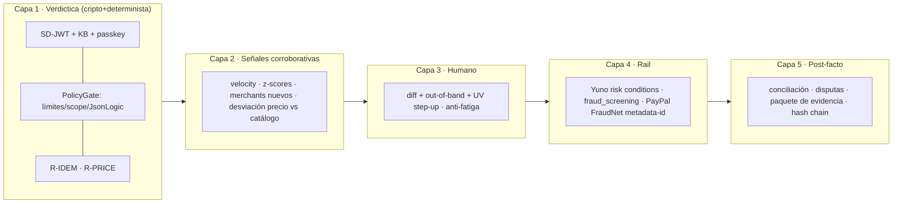

# Investigación Dev 3 — Estrategia de prevención de fraude para el flujo transaccional de Aval

**Rama:** `dev3/fraud-transaction-research` · **Fecha:** 2026-08-29 · **Estado:** investigación cerrada, dictamen de comité emitido.
**Alcance de equipo:** producida por Dev 3 (API backend). Los hallazgos alimentan directamente el carril de Dev 2 (fraude/contratos/idempotencia: PolicyGate, ledger, reglas) y los endpoints/webhooks de Dev 3; Dev 1 consume las señales del agente; Dev 4 el diff y el ladder en UI.

---

## 1. Resumen ejecutivo

1. **3DS autentica, no exculpa.** Un 3DS aprobado prueba que el emisor autenticó al consumidor en ESA transacción; no prueba ausencia de fraude: el friendly fraud representa ~20 % de las disputas fraudulentas globales según Visa y hasta ~75 % de los reclamos CNP según Mastercard. Autenticación del titular, autorización del pago, validación de identidad, prevención de fraude y responsabilidad ante contracargos son cinco cosas distintas (§4).
2. **Aval NO tiene liability shift de red y no debe venderlo.** Cobramos contra un token vaulteado de PayPal: no hay ECI 05/02 por transacción ni 3RI/COF marcado por nosotros. Lo que sí tenemos — y es la tesis del producto — es **evidencia criptográfica de autorización**: mandato firmado con passkey, intents firmados, gate determinista y trail hash-encadenado. Es exactamente el "compelling evidence" que PayPal pide y el "audit trail" que Mastercard describe para resolver disputas (§3, D-01).
3. **Nuestro patrón ya es estándar emergente.** El Agentic Authentication Working Group de FIDO (abr-2026), Mastercard Agent Pay/TrustKey y Visa Intelligent Commerce describen literalmente el diseño de Aval: instrucciones verificables del usuario con límites, autenticación del agente y delegación confiable para comercio. Somos isomorfos al estándar, ejecutado sobre PayPal/Yuno (§4.2).
4. **Defensa en 5 capas complementarias — nunca reemplazo de 3DS/autenticación/validaciones del procesador:** (1) cripto/determinista, (2) señales corroborativas, (3) humano con step-up escalonado, (4) señales del rail (Yuno risk conditions / PayPal FraudNet), (5) post-facto (conciliación + evidencia de disputa) (§9).
5. **Regla de oro del comité:** solo las señales *verdictivas* (firma inválida, límite duro, replay, amount≠offer) pueden REJECT; las señales *corroborativas* (comportamiento, velocity, contexto) como máximo ESCALATE/step-up. Ninguna señal conductual rechaza sola (§8).
6. **P0 determinista implementable en el hackathon:** idempotencia derivada de `jti` con verificación post-captura (R-PRICE), verificación de webhooks + pull del recurso, anti-burst con cooldown, step-up por umbral fijo (0.7 × `max_per_txn`), display del diff y generador del paquete de evidencia de disputa (§7, §13).
7. **Yuno es integrable y estratégico:** risk conditions (velocity/blocklists/allowlists), `fraud_screening`, 3DS con campo `liability_shift`, **stored credentials CIT/MIT con `network_transaction_id`** (resuelve el marcado formal COF que nos falta), webhooks HMAC, `X-Idempotency-Key`, y MCP server oficial con docs llm-ready. Dictamen: adapter `YunoRail` detrás de `PaymentRail` con mock fiel; PayPal queda como fallback garantizado del demo (§9.3, D-06).
8. **Perfil de riesgo persistente con privacidad por diseño:** agregados EWMA/histogramas hasheados con HMAC-KMS, señales crudas con TTL 24–72 h, consentimiento granular en la creación del mandato (en Colombia no existe interés legítimo general: Ley 1581 exige autorización; Brasil sí habilita legítimo interés antifraude: LGPD art. 11 II, f), y ruta de apelación humana (GDPR art. 22) (§10, §11).
9. **Anti-coerción y anti-fatiga:** el escalamiento muestra el diff (regla, valor vs umbral, presupuesto restante), confirma por canal out-of-band, exige passkey con UV para montos altos y limita la tasa de escalamientos por mandato (§7 R-BURST, §8).
10. **Nada de esto rompe contratos congelados hoy:** YunoRail, TTL de escalamiento por nivel y el renombrado de `open_dispute` quedan como propuestas que exigen registro de decisión (0020+) antes de tocar `contracts/` (§12).

---

## 2. Método

Cuatro subagentes investigaron en paralelo contra fuentes oficiales (PayPal developer docs, docs.y.uno, EMVCo, Visa, Mastercard, NIST, W3C/FIDO, IETF, EUR-Lex/EDPB/ICO, ANPD/SIC, RBI, OWASP):

| Perito | Dominio | Fuentes clave |
|---|---|---|
| A — Fraude y riesgo transaccional | Ciclo de vida, idempotencia, velocity, escenarios | developer.paypal.com, OWASP, Stripe, EMVCo |
| B — Identidad y comportamiento | Señales, perfil persistente, step-up, privacidad | NIST 800-63B rev4, W3C WebAuthn, FIDO, RTS PSD2 art. 18, GDPR, LGPD, Ley 1581 |
| C — Yuno + PayPal + arquitectura | Capacidades exactas de Yuno, mock, mapeo PaymentRail | docs.y.uno (llms.txt + .md), developer.paypal.com |
| D — Estándares de red | 3DS/3RI, Visa/MC, liability shift, regulación | emvco.com, visa.com, mastercard.com, EUR-Lex, CFPB, SIC |

Cada afirmación de los informes lleva etiqueta `[VERIFICADO]` (fuente oficial), `[VERIFICADO-2°]` (secundaria consistente), `[RECOMENDACIÓN]` o `[HIPÓTESIS]`. El comité (§3) contrastó los cuatro informes, resolvió las contradicciones que ellos mismos flaggearon y emitió el dictamen que gobierna este documento. Los informes completos con todas las URLs están en el historial de la sesión; aquí se consolidan las conclusiones con sus fuentes.

---

## 3. Dictamen del comité — contradicciones resueltas

| # | Tema en tensión | Posturas encontradas | **Dictamen** |
|---|---|---|---|
| D-01 | ¿Hay liability shift con vault PayPal? | A lo asumió como hipótesis y pidió confirmación; D lo confirmó: sin ECI/3RI/COF propio, el shift de red NO aplica; rige el régimen de disputas de PayPal (seller protection / compelling evidence) | **Confirmado: no existe shift.** Posicionamiento honesto ante jueces/emisores: "evidencia de autorización por diseño", nunca "liability shift". La revocación sincrónica + DELETE del token son nuestro kill switch real |
| D-02 | Timeout fail-closed 120 s vs cooling-off anticoerción | B citó precedentes (RBI 12 h primer beneficiario; UK hasta 72 h) que hacen 120 s insuficiente para montos altos; A defendió 120 s como implementación correcta de OWASP HITL | **El principio fail-closed no se negocia; la ventana sí puede ser por nivel.** 120 s para escalamientos estándar (contrato congelado); se propone TTL mayor (300 s, semántica RFC 9470 `max_age`) para escalamientos con UV de monto alto — cambio de contrato ⇒ registro de decisión, no silencioso |
| D-03 | ¿Es un baseline EWMA un "modelo" en el camino de enforcement? | B propuso EWMA como features; la restricción congelada dice "sin modelo en el camino de enforcement" | **Compatible con condiciones estrictas:** el baseline produce *features* deterministas (z-score reproducible dado el mismo estado); los umbrales son configuración fija; toda decisión audita features + versión de fórmula + evento de recalibración. Para el MVP: P0 usa umbrales fijos absolutos (0.7 × `max_per_txn`), P1 introduce baselines auditados |
| D-04 | ¿UV (biometría) o UP (presencia) al aprobar escalamientos? | A exigió UV en todo; B objetó que WebAuthn no vive nativo en Telegram/WhatsApp (deep-link rompe el presupuesto de 120 s) | **Escalonado:** aprobar escalamiento estándar = bot out-of-band mostrando diff (canal diverso). UV obligatoria para: crear/revocar mandato, subir límites, cambiar `payment_method_ref`, y escalamientos de monto alto (≥ 50 % `total_budget` o ≥ 0.7 × `max_per_txn` con señales corroborativas) vía deep-link con TTL propio (D-02) |
| D-05 | TTL de idempotencia local vs del rail | A: clave derivada de `jti` con TTL ≥ 45 días (ejemplo PayPal refund); C: ni Yuno ni PayPal documentan TTL contractual — no construir garantías > 24 h sin probar | **Clave idempotente = HMAC(`jti`)** usada igual en el constraint local y en el header del rail; persistida 45 días en `idempotency_keys`; ante cualquier duda, **reconciliar por pull** (`GET` del recurso) antes de asumir estado. El estado de verdad es nuestro, no el del PSP |
| D-06 | ¿PayPal directo o Yuno? | C: enrutar por Yuno (es el hackathon del sponsor, con MCP server y docs llm-ready); el enrollment CARD directo exige PCI ⇒ Testing Gateway/SDK | **PayPal permanece como rail garantizado del demo (contrato congelado); se añade `YunoRail` como adapter tras `PaymentRail` con mock fiel (`AVAL_RAIL=yuno\|yuno_mock\|paypal`).** La adopción de Yuno como principal es decisión de equipo (registro 0020+), no de esta investigación |
| D-07 | `open_dispute` no mapea a Yuno | C: Yuno solo recibe chargebacks (merchant responde evidencia o acepta); D: disputas PayPal son entrantes también | **Gap real del Protocol:** proponer en la siguiente revisión de contratos `get_status(external_ref)` y `respond_dispute(evidence)` (PayPal: provide-evidence; Yuno: POST dispute-evidence). No romper `contracts/` sin registro de decisión |
| D-08 | Nuestro trail prueba que el cobro fue "autorizado"… incluso si el agente fue comprometido dentro de límites | D: el propio trail podría debilitar un reclamo futuro del titular | **Trade-off aceptado — el mandato ES el producto.** Mitigaciones: mandatos mínimos por defecto, revocación trivial y sincrónica, escalamiento con diff, anti-burst (R-BURST), baseline del agente versionado por build. La respuesta correcta al riesgo no es debilitar la evidencia sino acotar la delegación |
| D-09 | Webhook Yuno sin timestamp/nonce anti-replay | C: doc afirma protección por HMAC pero no hay header de tiempo | **Procesar webhooks idempotentes** (clave `payment.id` + `type_event` + `retry`), **verificar HMAC sobre raw body** y **re-verificar por pull** antes de mutar estado. Igual política para PayPal (verify-webhook-signature + allow-list del host de `cert_url` + pull) |
| D-10 | ¿Señales conductuales del humano durante la propuesta del agente? | B: NO aplican (no hay humano presente; la delegación es 24/7 por diseño; fingerprint del agente es ruido) | **Aprobado el desdoblamiento por capa:** señales del humano solo en ceremonias (crear/revocar mandato, aprobar escalamiento); señales del agente (montos, merchants, inter-arrival, desviación de precio vs catálogo) en la propuesta. El horario del agente nunca es señal de rechazo sola (la delegación es 24/7) |

**Síntesis del dictamen:** la estrategia de Aval contra fraude complementa — y no sustituye — a 3DS, la autenticación del cliente y las validaciones del procesador: (i) movemos la autenticación fuerte a la ceremonia de delegación (passkey), (ii) hacemos la autorización verificable y determinista por transacción (mandato + gate), (iii) añadimos señales corroborativas que solo escalan, (iv) explotamos las señales del rail, y (v) cerramos el ciclo con conciliación y evidencia de disputa auto-generada.

---

## 4. Glosario crítico — qué prueba y qué no prueba cada mecanismo

| Concepto | Qué PRUEBA | Qué NO prueba | Fuente |
|---|---|---|---|
| 3DS aprobado (ECI 05/02) | El emisor autenticó al consumidor en esa transacción; habilita liability shift de fraude CNP | Que no haya fraude posterior; friendly fraud; disputas de servicio; ATO post-auth | emvco.com/emv-technologies/3d-secure · corporate.visa.com/.../3d-secure |
| 3RI / MIT / COF | Que el comercio declara un tipo de MIT bajo acuerdo CIT previo consentido | Identidad de quién dispara el cobro; consentimiento per-transacción | support.visaacceptance.com (art. 000003041) |
| AVS | Que el emisor reconoce la dirección de facturación | Identidad; posesión de tarjeta | developer.visa.com/capabilities/pav |
| CVV/CVV2 | Posesión de los datos del plástico | Identidad (un código filtrado pasa igual) | developer.visa.com/capabilities/pav |
| Tokenización de red (MDES/VTS) | El PAN no circula; token acotado a contexto | Que quien inicia el cobro esté autorizado | emvco.com/emv-technologies/payment-tokenisation |
| Passkey/WebAuthn (UV) | Posesión de clave privada en dispositivo del titular + factor local; phishing-resistant | Que el titular entendió el scope delegado; que el dispositivo no esté comprometido | w3.org/TR/webauthn-3 · mastercard.com (agentic-commerce-framework) |
| **Mandato SD-JWT + gate + trail (Aval)** | **Autorización previa específica del titular (límites, vigencia, scope) con firma verificable y ejecución conforme demostrable** | Liability shift de red; SCA per-transacción UE; que no haya friendly fraud | Patrón validado por Mastercard Agent Pay ("intent data + audit trail") |
| Autorización del pago (authz) | Decisión sobre ESTE acto (monto/destino) | Identidad o autenticidad del originante | NIST SP 800-63-3 §4 |
| Liability / contracargo | Quién absorbe la pérdida (régimen contractual de red/PSP) | Si hubo o no fraude de hecho | Visa/MC rules, PayPal seller protection |

**4.2. Aval y el estándar emergente (valor para jueces).** El FIDO Agentic Authentication WG (2026) define tres piezas — *Verifiable User Instructions* (delegación con autenticación phishing-resistant y límites verificables), *Agent Authentication* (los servicios verifican que el agente representa al usuario) y *Trusted Delegation for Commerce* (transacciones agent-initiated dentro de fronteras del usuario) — que corresponden 1:1 con mandato SD-JWT + KB, `cnf.jwk` y gate determinista. Mastercard Agent Pay exige tokens con "spend limits and validity windows" y produce un "audit trail to resolve cardholder disputes": exactamente `limits` + `validity` + nuestra hash chain. Visa Intelligent Commerce lista "spending limits, approval workflows, authentication requirements". Fuentes: fidoalliance.org (agentic standards), mastercard.com (agentic-commerce-framework, agent-pay), visa.com (intelligent-commerce).

---

## 5. Ciclo de vida de la transacción — controles por etapa

Mapping a nuestro flujo (mandato → intent → gate → captura → receipt → disputa) sobre el ciclo CNP con credencial vaulteada:

| Etapa | Controles | Señales de riesgo | Decisión posible | Estado en Aval |
|---|---|---|---|---|
| 1. Creación / intent | Scope, límites, binding token↔customer, `PayPal-Client-Metadata-Id` | amount > max_per_txn, merchant fuera de scope, `jti` duplicado | Aprobar / rechazar / escalar | ✅ mandato + PolicyGate; ⚠️ falta enviar metadata-id de riesgo |
| 2. Autenticación | Passkey (UP/UV) en ceremonia; KB-JWT (nonce/iat/exp) | exp vencido, `aud` erróneo, firma inválida | Rechazar / step-up | ✅ cubierto; ⚠️ falta exigir UV en actos críticos (D-04) |
| 3. Autorización | AUTHORIZE (hold 3 d / reauth 4–29 d), reserva atómica de presupuesto | holds prolongados, reauth repetitivos | Autorizar / void / escalar | ⚠️ parciales: hoy capturamos directo; propuesta P1 de fase auth diferida |
| 4. Captura | `PayPal-Request-Id`/`X-Idempotency-Key`, verificación post-captura (GET) | capture ≠ amount aprobado; `REQUEST_IN_PROCESS` | Capturar / void / auto-refund | ⚠️ idempotencia sí; **falta R-PRICE post-captura (P0)** |
| 5. Transferencia / liquidación | `seller_payable_breakdown`, Transaction Search | neto divergente, fee anómalo | Conciliar / alertar | ❌ falta job de conciliación (P1) |
| 6. Reverso / void | `POST .../authorizations/{id}/void` | revocación en ventana auth→capture; timeout de escalamiento | Void + auditoría | ❌ falta como acción automática (P1) |
| 7. Reembolso | refund con `invoice_id`/`custom_id`; 409/422 manejados | refund sin origen en el kernel | Permitir solo vía kernel | ❌ política de refund inexistente (P1: R-REFUND-GATE) |
| 8. Disputa | Disputes API (provide-evidence, deadlines `seller_response_due_date`); Yuno: dispute-evidence (PDF ≤ 1 MB base64) | UNAUTHORIZED con mandato vigente; racha de disputas | Defender / aceptar / pausar mandato | ⚠️ API integrada; **falta paquete de evidencia automático (P0)** |
| 9. Conciliación | Transaction Search ↔ hash chain ↔ Yuno reporting | divergencia ledger ↔ PSP | Alertar / pausar | ❌ falta (P1) |

Estados Yuno a modelar si se adopta `YunoRail` (async frecuente): `PENDING/{IN_PROCESS, PENDING_FRAUD_REVIEW, AUTHORIZED}` → `SUCCEEDED/APPROVED · DECLINED/FRAUD_DECLINED · ERROR/TIMEOUT`; webhook `payment.fraud_screening` cuando el decline ocurre sin llegar al provider. Fuente: docs.y.uno (status-and-response-codes/payment).

---

## 6. Modelo de amenazas — escenarios prioritarios

Ordenados por (probabilidad × impacto) para un flujo de compras por agentes:

| # | Escenario | Vector | Señal detectable | Control | Residual |
|---|---|---|---|---|---|
| T1 | **Prompt injection indirecto en ofertas** (OWASP LLM01) | Descripción de oferta instruye al agente | merchant/categoría fuera de patrón; desviación de precio vs catálogo; justificación que cita la oferta | LLM solo en `propose`; sin tool de pago; texto de oferta como dato delimitado; R-PRICE; step-up si offer nueva + monto alto | El catálogo ES el perímetro: un atacante con oferta "legítima" dentro de scope persiste |
| T2 | **Robo de la clave del agente** (`cnf.jwk`) | Extracción de Ed25519 privada del runtime | Firma válida desde contexto nuevo (IP/ASN/runtime); burst de intents; rotación reciente + primer intent grande | KB + exp 120 s + scope; anti-burst; baseline del agente versionado; rotación exige passkey | Sin telemetría de origen, firma válida = indistinguible hasta detectar patrón |
| T3 | **Replay de mandato/intent** | Reenvío de capturas previas | Colisión `jti`/`nonce`; `exp` vencido | Unique constraints + exp + clave idempotente derivada (D-05) | Cubre la clave NO robada; con clave robada genera jtis frescos (T2) |
| T4 | **Coerción sobre el aprobador humano** | Urgencia fabricada; bombardeo de escalamientos (fatiga) | Tasa de aprobación ~100 %; latencia < 2 s en diff complejo; cadena de escalamientos | Diff cripto (monto/merchant/restante); canal out-of-band; rate-limit de escalamientos + cooldown; UV en montos altos (D-04) | Ingeniería social no se elimina; se encarece |
| T5 | **Manipulación de catálogo (TOCTOU precio)** | Oferta muta entre propuesta y captura | capture amount ≠ amount aprobado | **R-PRICE (P0):** order con amount exacto del intent + GET post-captura + auto-refund y `FRAUD_ALERT` en mismatch | Ventana verificación→liquidación; disciplina de conciliación |
| T6 | **Webhook falsificado** | POST forjado como `PAYMENT.CAPTURE.COMPLETED` / disputa | Firma inválida; `cert_url` fuera de host oficial; HMAC no coincide | R-WEBHOOK (P0): verificación oficial + allow-list de hosts + pull del recurso antes de mutar | Dependencia de la API de verificación — fail-closed |
| T7 | **Abuso de reembolsos/disputas (first-party)** | El titular disputa compras que mandateó | Disputa UNAUTHORIZED con mandato vigente y trail completo | Paquete de evidencia automático (P0); contador de disputas → step-up/pausa | Decisión final discrecional de PayPal; ventana de 180 días del comprador |
| T8 | **Card testing en onboarding** | Scripting sobre setup/enrollment | Racha de declines; múltiples tokens por customer | Token creado una vez tras passkey; límite de vault-bindings/24 h (caso Weee!: 10→3) | Bajo: vault único; onboarding es la superficie |
| T9 | **DoS económico del presupuesto** | Agente legítimo-claveado maximiza gasto dentro de límites; loop de retries | Saturación de `max_txn.count`; burst; estructuración bajo `max_per_txn` | `total_budget` + reserva atómica (existente); R-BURST; tope de autorizaciones abiertas | Un mandato generoso es un cheque en blanco → mandatos mínimos por defecto |
| T10 | **ATO de la cuenta del humano** | Sesión web/PayPal comprometida; el atacante "aprueba más, revoca menos" | Creación de mandato desde dispositivo/geo nuevo; re-vaulting inmediato post-revocación | UV en crear/revocar/cambiar instrumento (D-04); notificación out-of-band en todo cambio de mandato | Malware en el dispositivo del titular firma igual; los límites son el último dique |

---

## 7. Reglas de negocio priorizadas

**P0 — deterministas, implementables en el hackathon:**

| ID | Regla | Detalle | Mitiga |
|---|---|---|---|
| R-IDEM | Idempotencia derivada | `PayPal-Request-Id`/`X-Idempotency-Key` = HMAC(`jti`) en TODA llamada create/capture/refund; retries reutilizan clave; 409/`REQUEST_IN_PROCESS` → backoff; persistir 45 días | T3, duplicados |
| R-PRICE | Integridad de monto | Order con amount byte-igual al del intent firmado; GET post-captura; mismatch ⇒ refund inmediato + `FRAUD_ALERT` | T1, T5 |
| R-WEBHOOK | Webhooks confiables | Verificación de firma (PayPal API / HMAC Yuno sobre raw body) + allow-list de hosts de certificado + pull del recurso antes de mutar estado | T6 |
| R-BURST | Anti-burst/anti-fatiga | > 3 intents del mismo mandato en 60 s ⇒ ESCALATED + cooldown 10 min; > N escalamientos/hora ⇒ auto-pausa del mandato | T4, T9 |
| R-STEPUP | Step-up por umbral fijo | amount ≥ 0.7 × `max_per_txn`, o ≥ 50 % `total_budget` consumido ⇒ escalado con UV (deep-link) | T1, T2, T7 |
| R-EVIDENCE | Paquete de evidencia | Export automático (mandato + verificación passkey + JWS del intent + decisión del gate + trail) para `provide-evidence` / dispute-evidence | T7 |
| R-REVOKE | Doble kill switch (ya diseñado) | Verificación de revocación DENTRO de la tx de cobro + `DELETE /v3/vault/payment-tokens/{id}` (Yuno: `unenroll`) | T2, T10 |

**P1 — endurecimiento inmediato post-hackathon:**

- R-VELOCITY: matrices de velocity por (mandato, merchant, hora) y (mandato, bucket de monto) — el patrón oficial de card-testing ("by dollar amount, user IP, billing address, BIN, or device").
- R-BASELINE: z-scores EWMA como features auditadas (D-03) sobre montos, categorías y merchants del par humano-agente y del agente (versionado por build).
- R-AUTH-DIFFERIDA: fase AUTHORIZE→(ventana de revocación)→CAPTURE; void automático en timeout fail-closed con autorización abierta.
- R-REFUND-GATE: refunds solo iniciados por el kernel con verificación de mandato y manejo de `REFUND_AMOUNT_EXCEEDED`.
- R-RECON: job de conciliación diario (Transaction Search / reporting Yuno ↔ hash chain); divergencia ⇒ pausa + alerta.
- R-VAULT-LIMIT: máx. 3 vault-bindings por humano / 24 h.
- R-FIRST-PARTY: contador de disputas del payer ≥ 2 en 90 días ⇒ step-up para toda nueva compra.

**P2 — madurez:**

- R-KEY-ROTATION: rotación de `cnf.jwk` con re-aprobación passkey y gracia corta.
- R-CONTEXT-BINDING: fingerprint del runtime del agente firmado dentro del KB-JWT (detecta T2 sin telemetría externa).
- R-COOLING: cooling-off para primer escalamiento del mandato / beneficiario nuevo (precedente RBI 12 h, escalado a minutos-horas según UX).
- R-BOTAUTH: firma de mensajes agente→comercio estilo Web Bot Auth / RFC 9421 (Cloudflare/Mastercard ya lo despliegan) para distinguir bots legítimos.

---

## 8. Matriz de riesgo y decisiones

Ladder de verificación escalonada (anclas NIST 800-63B rev4; semántica RFC 9470):

| Nivel | Mecanismo | Disparo objetivo |
|---|---|---|
| L0 pasivo | Señales sin fricción | Por defecto en toda propuesta |
| L1 pasivo endurecido | Velocity reducida + TRA-like (RTS art. 18 como taxonomía) | 1 señal corroborativa fuerte o 2 débiles; z ∈ [2,3) |
| L2 challenge passkey UV | WebAuthn con `userVerification: required` | z ≥ 3 en monto; amount ≥ 0.7 × `max_per_txn`; primer merchant nuevo + monto > mediana |
| L3 aprobación bot out-of-band | Diff completo + timeout fail-closed 120 s | Cualquier frontera del gate (≥ 80 % budget, count al tope, condición no evaluable) |
| L3+ bot + firma UV del diff | Firma WebAuthn del hash del diff (patrón SPC/dynamic linking) | Amount ≥ 50 % `total_budget`; primer escalamiento del mandato; clave del agente con edad < X h |
| L4 bloqueo / kill switch | REJECTED + revocación + reactivación diferida | Firma inválida; límite duro; 3 escalamientos sin respuesta; post-revocación |

Matriz de decisiones (determinista; solo verdictivas rechazan):

| # | Señales combinadas | Acción |
|---|---|---|
| M1 | amount > p95/baseline **y** merchant nuevo **y** madrugada (canal humano) | REVIEW (L3) |
| M2 | Firma KB válida **pero** contexto nuevo **y** ≥ 3 intents/10 min | REJECT + alerta robo de clave (T2) |
| M3 | `jti` repetido ∨ `exp` vencido ∨ `nonce` visto | REJECT silencioso + `FRAUD_ALERT` |
| M4 | capture amount ≠ amount aprobado | REJECT post-hoc: auto-refund + pausa |
| M5 | merchant/categoría fuera de scope | REJECT (PolicyGate existente) |
| M6 | webhook sin firma válida ∨ host no permitido | Descartar evento (no muta estado) |
| M7 | monto ≤ p50 **y** merchant frecuente **y** velocity normal | APPROVE |
| M8 | amount > p95 **y** merchant ∈ scope **y** velocity normal | STEP-UP (L2) → timeout ⇒ REVIEW fail-closed |
| M9 | ≥ 2 disputas abiertas del payer en 90 días | REVIEW + R-FIRST-PARTY |
| M10 | uso de budget ≥ 80 % | STEP-UP para cada nueva compra |
| M11 | > k autorizaciones abiertas simultáneas | REVIEW (loop/DoS económico) |
| M12 | revocación dentro de la tx de cobro | REJECT + DELETE token |
| M13 | racha ≥ 5 declines del rail / 24 h | REJECT + pausa de onboarding |

---

## 9. Arquitectura e integración (PayPal / Yuno / mock)

### 9.1 Defensa en capas



### 9.2 Mapeo `PaymentRail` → Yuno (adapter `YunoRail`)

| Método Aval | Yuno | Notas |
|---|---|---|
| `create_setup_token` | `POST /customers` + `POST /customers/{cid}/payment-methods` (→ `vaulted_token`) | Sin PCI, enrollment vía SDK/Testing Gateway; la aprobación humana = firma del mandato + pantalla de enrollment |
| `exchange_payment_token` | — (no existe paso intermedio) | El enrollment ya devuelve `vaulted_token` |
| `delete_payment_token` | `POST /customers/{cid}/payment-methods/{vaulted_token}/unenroll` | Es POST, no DELETE |
| `capture` | `POST /payments` con `vaulted_token` + `stored_credentials{reason:CARD_ON_FILE, usage:FIRST|USED}` + `X-Idempotency-Key` | Puede volver `PENDING/IN_PROCESS` ⇒ Receipt no-terminal + webhook |
| `open_dispute` | **No mapea** — disputas entrantes solamente | Gap D-07: `respond_dispute` + `get_status` como propuesta de contrato |
| `verify_webhook` | HMAC-SHA256 (`x-hmac-signature` sobre raw body) | Sin timestamp ⇒ procesar idempotente + pull (D-09) |

**Señales a conservar por transacción (trazabilidad):** de Yuno — `payment.id`, `merchant_order_id`, status/sub_status con timestamps, `transactions[]` (id, provider_transaction_id, response_code), `fraud_screening` completo, `three_d_secure.{eci, liability_shift}`, `fingerprint`, `network_transaction_id`; de PayPal — order/capture id, `PayPal-Request-Id` usado, `debug_id` de errores, payer_id, shipping, dispute_id + due dates; de ambos — webhooks crudos (headers + raw body + resultado de verificación) en tabla append-only. Enviar: `PayPal-Client-Metadata-Id` (sesión FraudNet capturada en la aprobación del setup, persistida en el mandato) en cada order MIT.

### 9.3 Mock fiel de Yuno (red de seguridad del demo)

El mock replica el contrato real verificado (docs.y.uno accesible; sin credenciales de sandbox aún): auth `public-api-key`/`private-secret-key` + `X-Idempotency-Key` (UUID); `POST /payments` con `payment_method.vaulted_token`, `detail.card.capture:true`, `stored_credentials`; estados reducidos fieles (`CREATED → PENDING/{IN_PROCESS, PENDING_FRAUD_REVIEW, AUTHORIZED} → SUCCEEDED/APPROVED | DECLINED/FRAUD_DECLINED | ERROR/TIMEOUT`) con `mock_mode` inyectable (`approve|decline|fraud_decline|async|timeout`); webhook v2 exacto `{type_event:"payment.purchase", version:2, retry, data:{payment}}` con HMAC real y reintentos comprimibles; disputas como `payment.chargeback` entrante + endpoint de evidencia. Intercambiable por configuración: `AVAL_RAIL=yuno|yuno_mock|paypal`.

---

## 10. Modelo de datos mínimo — perfil de riesgo persistente

Principios: sujetos pseudónimos (humano y agente comparten esquema), identificadores hasheados con HMAC (clave en KMS, rotación mensual), señales crudas con TTL, agregados rolando 13 meses, auditoría que referencia IDs (nunca payloads personales) para compatibilizar erasabilidad con hash chain.

```sql
-- [Dev 2] sujeto pseudónimo: humano y agente
CREATE TABLE risk_subject (
  subject_id  uuid PRIMARY KEY,
  kind        text NOT NULL CHECK (kind IN ('human','agent')),
  agent_build text,                                -- versiona baseline del agente (D-08/D.5)
  reid_ref    bytea                                -- HMAC(subject→persona); acceso solo apelación
);

-- agregados EWMA (sin datos crudos); retención rolando 13 meses
CREATE TABLE baseline_metric (
  subject_id uuid REFERENCES risk_subject, metric text,   -- txn_amount|interarrival_s|amount_ratio_budget
  ewma double precision, ewma_var double precision, lambda double precision DEFAULT 0.15,
  n_obs bigint, updated_at timestamptz,
  PRIMARY KEY (subject_id, metric)
);

-- histogramas hasheados (merchant/categoría)
CREATE TABLE baseline_hist (
  subject_id uuid REFERENCES risk_subject, dim text, value_h bytea,   -- HMAC(merchant_id)
  count bigint, last_seen timestamptz, PRIMARY KEY (subject_id, dim, value_h)
);

-- señales crudas con TTL 24–72 h; partición diaria
CREATE TABLE signal_event (
  id bigint GENERATED ALWAYS AS IDENTITY, ts timestamptz DEFAULT now(),
  subject_id uuid, mandate_jti text, intent_jti text,
  signal_type text,        -- ip_h|fp_h|geo_coarse|bot_latency|agent_runtime|price_dev
  value_h bytea, value_plain jsonb, expires_at timestamptz NOT NULL,
  PRIMARY KEY (id, ts)
) PARTITION BY RANGE (ts);

-- contadores de velocity (autolimpiantes)
CREATE TABLE velocity_counter (
  subject_id uuid, counter_name text, window text,      -- intents|amount_sum|new_merchant|escalations
  bucket_start timestamptz, val numeric,
  PRIMARY KEY (subject_id, counter_name, window, bucket_start)
);

-- listas (dominio de Yuno risk conditions, réplica local)
CREATE TABLE risk_list (
  subject_type text,        -- merchant|agent|device|payer
  subject_id_h bytea, list text CHECK (list IN ('block','allow')), reason text, expires_at timestamptz
);

-- webhooks crudos archivados (evidencia primaria)
CREATE TABLE webhook_archive (
  id bigint GENERATED ALWAYS AS IDENTITY PRIMARY KEY, received_at timestamptz DEFAULT now(),
  source text,             -- paypal|yuno|yuno_mock
  headers jsonb, raw_body bytea, signature_valid boolean, resource_pulled boolean
);

-- idempotencia (ya existe en migración [2]; ampliar TTL a 45 días y derivar clave de jti)
-- CREATE TABLE idempotency_keys (...)
```

Hasheado (HMAC-KMS): IP, fingerprint, merchant_id, teléfono. Plano: montos, categorías, scores, reason codes. Las decisiones viven en `audit_events` (hash chain existente) referenciando `intent_jti` + features + versión de reglas.

---

## 11. Privacidad, seguridad, auditoría y cumplimiento

- **Minimización y retención (GDPR arts. 5.1.c/e, 25, 32):** señales crudas 24–72 h; agregados 13 meses rolantes; velocity ≈ 2× ventana máxima; auditoría indefinida pero sin payloads personales. Pseudonimización según directrices EDPB 01/2025 (separación de la tabla de re-identificación).
- **Base legal LatAm:** Colombia (Ley 1581) no tiene interés legítimo general ⇒ **consentimiento granular en la ceremonia del mandato** ("perfil de riesgo antifraude": señales + retención + apelación). Brasil (LGPD art. 11, II, f) habilita explícitamente tratamiento para prevención de fraude. Fingerprinting del canal humano arrastra ePrivacy art. 5(3) si hay usuarios UE.
- **Decisiones automatizadas (GDPR art. 22):** todo REJECTED/ESCALATED lleva reason codes + señales contribuyentes + ruta de apelación en el mismo flujo del bot; la revisión humana debe ser significativa (ICO), no un botón "reintentar".
- **Sesgos y falsos positivos:** cold start (< 10 obs) ⇒ sin baseline, ladder más estricta hacia fricción (ESCALATED, no REJECTED); umbrales conservadores de arranque; sin categorías protegidas ni proxies como features; monitoreo de FP por segmento como métrica de producto.
- **Recalibración:** EWMA λ ≈ 0,15; aprobación humana de escalamiento entra al baseline con peso completo; transacción absuelta en apelación NO entra (anti-envenenamiento); drift legítimo se absorbe en 5–10 observaciones.
- **Auditoría:** ya existente (hash chain + roots KMS + witness GCS); añadir eventos `risk.stepup_required`, `risk.signal`, `fraud.alert`, `recon.divergence` y el archivo de webhooks crudos (§10).
- **PCI:** flujo vault/token implica que la PAN nunca toca Aval (SAQ A-territory con SDKs); nunca loggear datos del payer beyond IDs.

---

## 12. Riesgos, limitaciones y preguntas abiertas

**Riesgos y limitaciones:**

1. Sandbox ≠ producción: las disputas PayPal sandbox no ponderan "compelling evidence" (`adjudicate` es sandbox-only); el valor probatorio del paquete es hipótesis hasta piloto real.
2. TTLs de idempotencia de Yuno/PayPal no están contratados en la doc — no construir garantías > 24 h sin prueba; siempre reconciliar por pull.
3. Yuno requiere pasos de configuración no-código (risk conditions → routing publicado) que pueden fallar el día del demo: preparar capturas del dashboard como respaldo y verificar headers de auth (la doc es inconsistente en casing) contra sandbox.
4. El trail que prueba autorización también puede oponerse al titular en T2-dentro-de-límites (D-08): mitigado con mandatos mínimos y revocación trivial.
5. La promesa "una autenticación para siempre" no sostiene en UE sin más: las compras agénticas de monto/comercio variables no encajan las exenciones PSD2 art. 13/17; habría que invocar TRA/bajo valor o autenticar por carga.
6. 120 s puede quedarse corto para UV por deep-link entre canales (D-02/D-04): medir en el demo.

**Preguntas abiertas (decisiones de equipo):**

- [ ] ¿Ratificamos `YunoRail` + mock como camino al demo (registro de decisión 0020, actualizando `contracts/schemas.md` §3 con `get_status`/`respond_dispute`)?
- [ ] ¿TTL de escalamiento por nivel (120 s estándar / 300 s con UV)? Es cambio de contrato congelado.
- [ ] ¿Conseguimos credenciales sandbox de Yuno a tiempo (account_id + keys)? ¿Enrollment vía Testing Gateway?
- [ ] ¿Quién implementa P0 — Dev 2 (reglas en gate) vs Dev 3 (webhooks/idempotencia/conciliación)? Propuesta: R-IDEM/R-WEBHOOK/R-EVIDENCE en Dev 3; R-PRICE/R-BURST/R-STEPUP en Dev 2 (el gate ya es suyo).
- [ ] ¿Versionar el baseline del agente por build desde el día 1 (evita FPs en redeploys)?
- [ ] ¿Consentimiento granular antifraude en la UI del mandato (Dev 4) para Colombia?

---

## 13. Roadmap por fases

**Fase MVP (hackathon):**
- R-IDEM, R-PRICE, R-WEBHOOK, R-BURST, R-STEPUP (umbral fijo 0.7 × `max_per_txn`), R-EVIDENCE.
- Diff enriquecido en el bot (regla, valor vs umbral, restante).
- `webhook_archive` + envío de `PayPal-Client-Metadata-Id`.
- Mock de Yuno detrás de `PaymentRail`; `YunoRail` real si hay credenciales (1–2 días estimados con los endpoints ya mapeados).
- Fixture de ataque para el demo: oferta adversarial (T1) + replay (T3) + webhook falsificado (T6).

**Fase endurecimiento (semanas 1–4 post-evento):**
- R-VELOCITY, R-BASELINE (features auditadas), R-AUTH-DIFERIDA (void), R-REFUND-GATE, R-RECON, R-VAULT-LIMIT, R-FIRST-PARTY.
- Ladder completo L0–L4 con deep-link UV; risk lists locales; recalibración programada.
- Yuno real como rail principal con stored credentials CIT/MIT (`network_transaction_id`).

**Fase escalamiento (producción):**
- Scoring conductual como servicio fuera del camino de enforcement (features → gate); calibración TRA-like con tasas reales.
- Web Bot Auth / RFC 9421 agente→comercio; R-KEY-ROTATION, R-CONTEXT-BINDING, R-COOLING.
- Tracking de rieles agénticos nativos (Visa Intelligent Commerce, Mastercard Agent Pay/TrustKey) para reconocimiento formal de red; evaluación de seller protection con pilotos de disputas reales.

---

## 14. Fuentes principales

**PayPal:** developer.paypal.com — Orders v2, Payments v2 (authorizations/captures/refunds), Payment Tokens v3, Customer Disputes v1, Webhooks v1 (verify-webhook-signature), Transaction Search v1, REST requests (PayPal-Request-Id), FraudNet/`PayPal-Client-Metadata-Id`; paypal.com/legalhub (seller-protection, buyer-protection); paypal.com/brc (carding attacks).
**Yuno:** docs.y.uno — what-is-yuno, reference (payments/create-payment, status-and-response-codes/payment, authentication/X-Idempotency-Key, enroll/unenroll payment-methods, refund, checkout-sessions), basic-concepts (tokens, sessions), payment-features/stored-credentials, security-and-compliance (3d-secure, pci-compliance), webhooks (configure, verify-hmac, object-and-examples), risk-conditions, chargeback-management, payment-type-list, ai-capabilities (MCP + llms-ready docs).
**EMVCo / redes:** emvco.com (3d-secure, payment-tokenisation, secure-remote-commerce); visa.com/corporate (3d-secure, friendly-fraud, intelligent-commerce, payment-passkey, click-to-pay); support.visaacceptance.com (stored-credential/MIT framework 000003041); mastercard.com (identity-check, trusted-transactions, agent-pay, agentic-commerce-framework, ethoca-alerts); chargebackgurus/chargebacks911 (reason codes 10.4/4837, CE3.0 — secundarias).
**Identidad/estándares:** NIST SP 800-63-3/-63B rev4 (identity proofing, AAL, session); W3C WebAuthn L3; FIDO Alliance (SPC; Agentic Authentication WG 2026); IETF RFC 9901 (SD-JWT), RFC 8785 (JCS), RFC 7797 (detached JWS), RFC 9470 (step-up).
**Regulación:** EUR-Lex GDPR 2016/679 y RTS 2018/389 (SCA/exenciones, art. 18 TRA) + FCA Handbook; EDPB 01/2025 (pseudonimización); ICO (art. 22); LGPD (Planalto; ANPD legítimo interés) ; Ley 1581 + SIC (Colombia); RBI (cooling-off 12 h); CFPB Reg E 12 CFR §1005.6.
**Seguridad aplicada:** OWASP API Top 10 2023 (API2, API7), OWASP GenAI LLM Top 10 (LLM01 prompt injection, LLM06 excessive agency); NIST/SEMATECH (EWMA); arXiv 2501.09674 (Authenticated Delegation).
